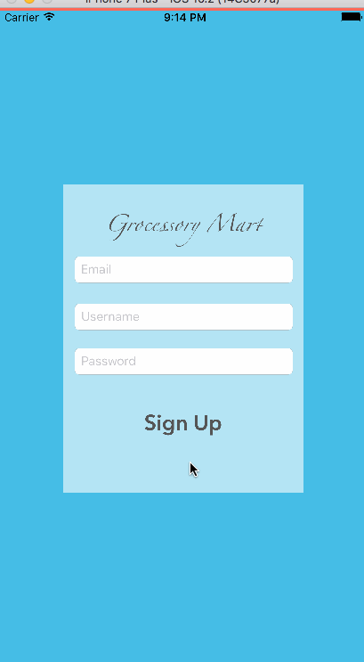

# Ecommerce-iOS-App

## Synopsis
Ecommerce is a **mobile ecommerce app based recommendation system**. The mobile app is programmed in **Swift** and uses RESTful services to process time intensive operations on the cloud and display the result on the app. The backend of the application is designed in PHP to suggest the next basket item using **Apriori algorithm**. Decisions are made based on historical transaction data and the user's purchase history. It is designed in PHP 

### Swift Version: 3.0.2
### XCode Version: 8.2 beta

## Application Functionalities

1. Login/SignUp by verifying with MYSQL database on AWS EC2 instance.
2. A Table View is populated by the JSON data fetched from the database through RESTful services.
3. The user selects the item and adds the cart in the next  screen.
4. The user also submits a response of the product. The sentiment of the response is generated and stored in the database.
5. From the first time selected, a list of next basket items are recommended to the user in the consecutive table views.

## License
Copyright © 2017 Pavani Vellal. All rights reserved.

